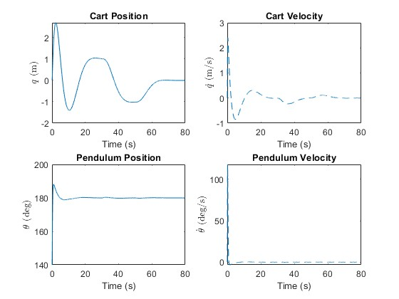
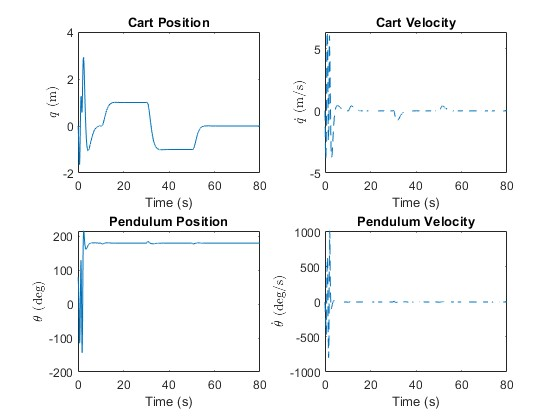

# Inverted Pendulum on a Cart with Linear Controller

Contains linearization based controller for command following with an observer based state feedback. Run **simplePendulumOnACart_v0.m** to load the variable into the workspace and run **simplePendulumOnACart0.slx**.

**simplePendulumOnACart_v0.m** has only the tracking controller and doesn't have the implementation of the observer. For the observer, run **simplePendulumOnACart0.slx**. Observer might not converge and thus controller might not work if initial conditions are too far from the equilibrium.

A destabilizing controller is runs when the pendulum faces downwards and a stabilizing contorller runs to stabilize it in the upward position once the pendulum crosses a user specified threshold. $\frac{3}{4} \pi <= \theta <=\frac{3}{4} \pi$ is the threshold currently. Set the threshold in **pendulum_cart_tracking.m**.

**simplePendulumOnACart_v0.m** runs an animation after simulating the nonlinear pendulum cart system for $80$ $s$. The reference positions for the cart are as follows:

1) $0\ m$ for $t < 1\ s$
2) $1\ m$ for $10\ s < t <= 30\ s$
3) $-1\ m$ for $30\ s < t <= 50\ s$
4) $0\ m$ for $50\ s < t$

You may set the initial conditions from **simplePendulumOnACart_v0.m** and the reference positions from **pendulum_cart_tracking.m**.

## Results
Here are some results with different gain values. Feel free to tune the parameters and mess around with the code.

  
  

Click here for the animations.
- [Demo 1](https://youtu.be/wF3t1BsLJ9M)
- [Demo 2](https://youtu.be/dSFHy8AWpdc)